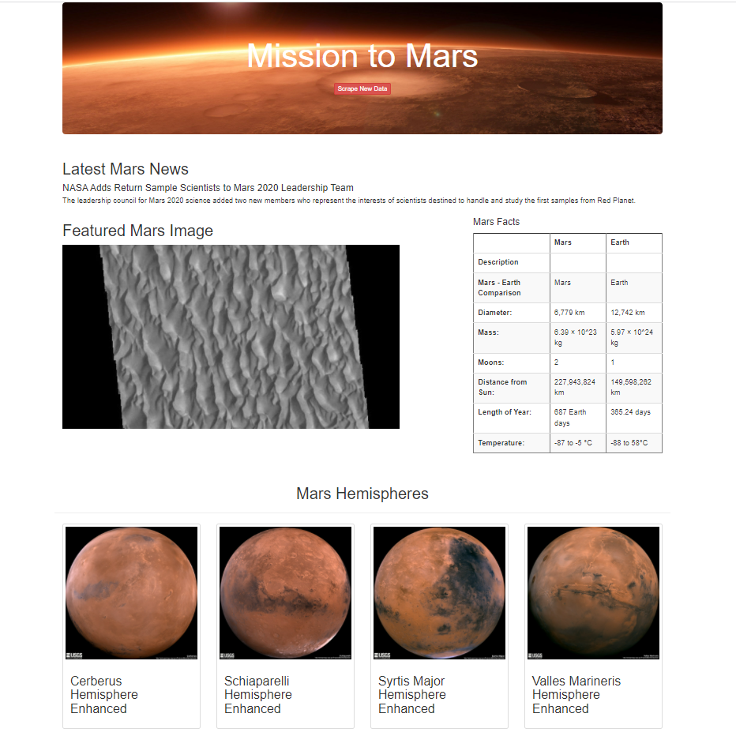

# Mission-to-Mars
You can find the analysis files here: [scraping.py](https://github.com/NedaAJ/Mission-to-Mars/blob/main/scraping.py) | [index.html](https://github.com/NedaAJ/Mission-to-Mars/blob/main/templates/index.html) | [Mission_to_Mars_Challenge.ipynb](https://github.com/NedaAJ/Mission-to-Mars/blob/main/Mission_to_Mars_Challenge.ipynb)

## Overview of Analysis
The goal of this project was to learn how to scrape data from the NASA Science Mars Exploration website using Chrome Developer tools to identify HTML components, Beautiful Soup/Splinter to automate a web browser and perform the scrape, MongoDB to store the data, and Flask to create a web application to display the data. The purpose of the procedure was to create an app that would scrape the following information about Mars:
- Latest News
- Featured Image
- Facts about the planet
- Images of the hemispheres

## Results

## Summary of Analysis

## Contact:
- Email : [neda.ahmadi.jesh@gmail.com](mailto:neda.ahmadi.jesh@gmail.com?subject=[GitHub]%20Source%20Han%20Sans)
- Linkedin: www.linkedin.com/in/neda-ahmadi-j
